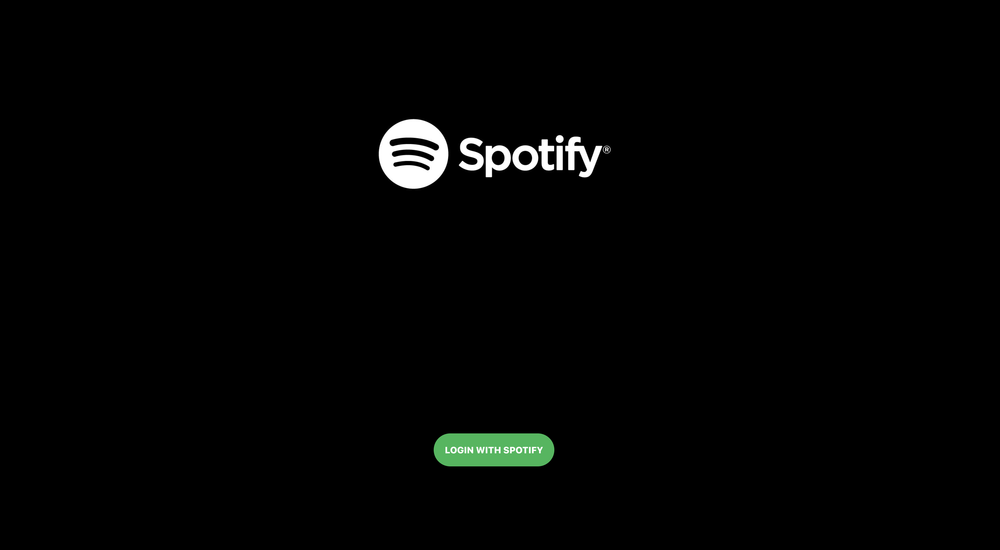
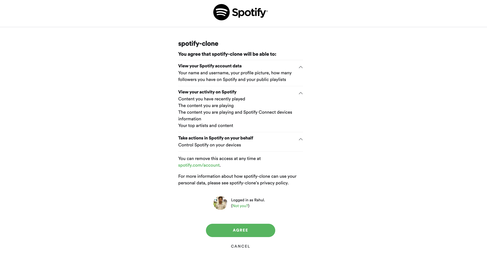
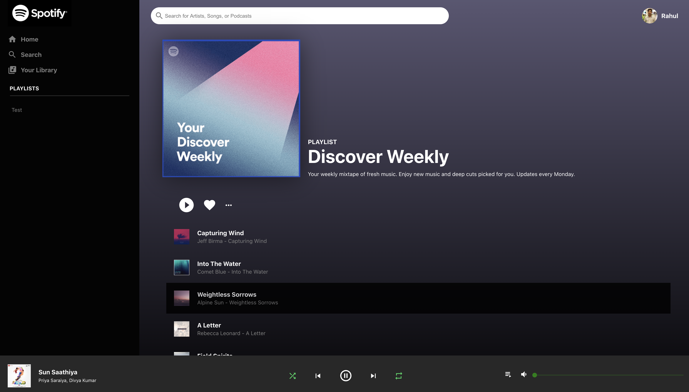

# SPOTIFY CONTROLLER

A Spotify controller app created using React.js and Firebase that allows playback control of songs playing on other device

## Hosted on Firebase

Live Demo - [Click here](https://spotify-clone-react.web.app/)

## Sample Screenshots

### Home Page

### Spotify Login

### Player Page

## To run locally

`npm install`

`npm start`
